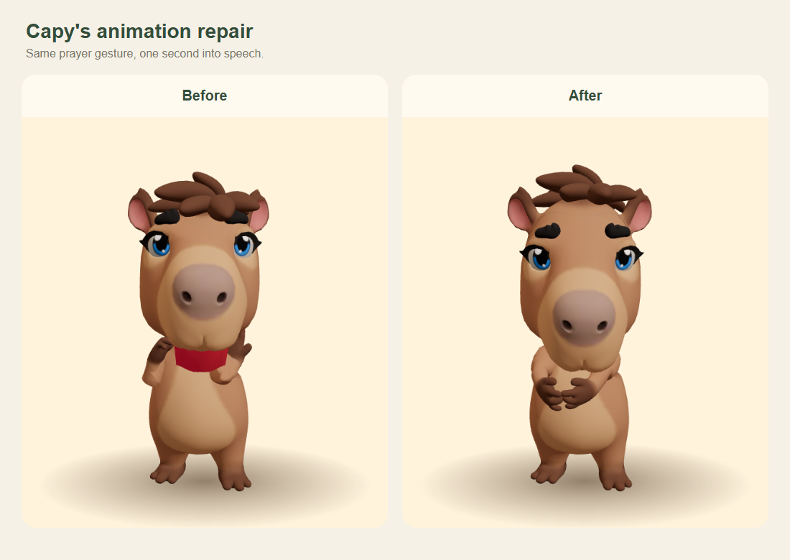

# Avatar gesture repair

Speaking with `pray_hands` bent the arms into the neck and exposed a red strip of mouth geometry below the muzzle. `listen_nod` also detached the mouth from the head. The exported Rigify skeleton has 55 independent facial roots: source animation tracks move those roots correctly, but adding rotation only to the head leaves them behind. Large additive arm rotations also compounded the arm movement already present in `talk_a`.

Gesture controls now run in a separate animation mixer. The rig layer transports the independent facial roots with the head's change in transform, including the look direction. Arm gestures blend toward complete poses relative to the chest, reusing the existing baked prayer and heart poses. The waving and celebration poses use a smaller range of motion. A hop moves the complete character. The prior frame's unmodified pose is restored before each mixer update so offsets cannot accumulate.

The GLB and source FBX are unchanged. The viewer clones the cached skeleton before normalization, fixing the oversized model in the Strict Mode preview. Unmounting clears animation timers; interrupted gestures release their pose; finished events from an old fading base animation cannot interrupt the current action.

## Validation

- Avatar and mobile typechecks, content tests, avatar build, and web export pass.
- `scripts/check-rig.mjs` examines 259 frames across all seven gestures, look offsets, rapid interruptions, and twelve base/pose clips. It verifies facial attachment, finite skinned bounds, and zero remaining pose weight after returning to idle.
- In the recorded run, facial position error was below `5e-15` in head coordinates, maximum skinned extent was 1.637 scene units, and remaining gesture weight was zero. A small tolerance on the linear matrix terms accounts for the source skeleton's nonuniform scales.
- Exact-time captures from `/preview.html` reproduce the original bug and show the corrected prayer pose. The rebuilt app was also checked in the happy prayer moment. Physical device verification remains outstanding.

Run the avatar dev server, set `PLAYWRIGHT_CHROMIUM` if needed, then run `node packages/avatar-web/scripts/check-rig.mjs`. `CAPY_AVATAR_URL` can point to another local avatar preview. The head probe remains available; direct deformation-bone probes are no longer applied to the live rig.

