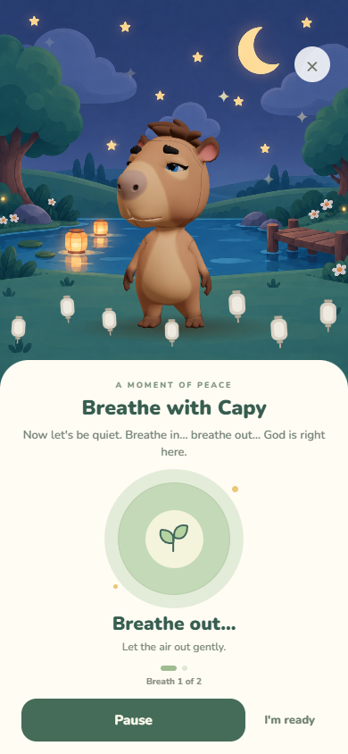

# Guided quiet time

The place visit used the prayer-repetition hint for its listening beat: it told the child to speak and tap a button while displaying a breathing circle. The place runner now takes a dedicated quiet-time prompt from the English content pack and reuses its existing Arthur recording.

Regular listening beats and breathing minigames now share a compact sage-and-cream card. The child starts when ready, follows an expanding/contracting glow, sees the current breath, and can pause, resume, or finish early. Completion waits for Continue. Bedtime lights-out keeps its separate automatic flow.

One animated timeline drives both the glow and phase labels. Each configured duration contains complete inhale/exhale cycles, so a 15-second exercise ends after two gentle breaths. Leaving the foreground pauses the exercise. Reduced motion keeps the illustration still while phase labels and progress remain available. New child-facing copy and the place prompt live in `companion.breathing` in the content pack (v0.8.1).

Validation: five breathing-timing tests, mobile typecheck, all mobile/content tests, content validation, avatar build, and web export pass. `tools/breathing-smoke.cjs` exercises the actual Places → Pond flow, incorrect-hint regression, phase changes, frozen pause, resume, explicit completion, early exit, 320px layout, and reduced motion. Screenshots were inspected at 390×844 and 320×568. Physical-device testing remains outstanding.

