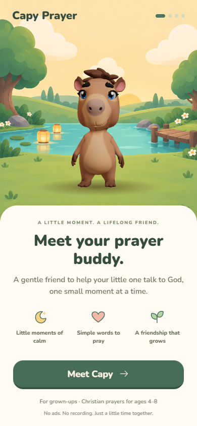
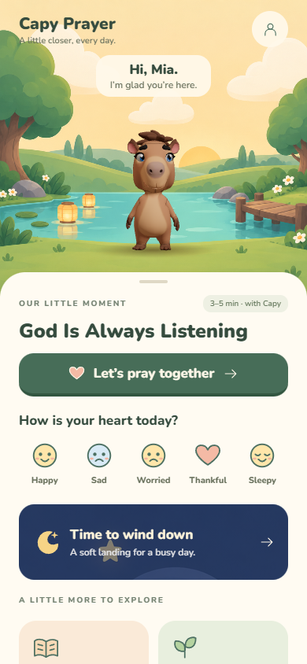
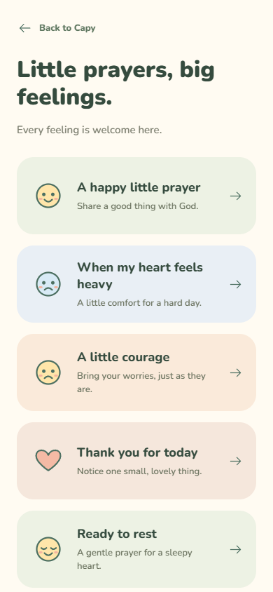
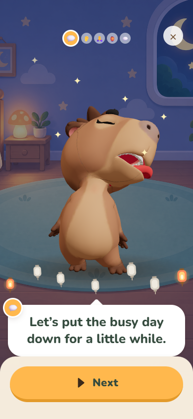

# Companion experience · v0.8

Based on `48ae203`. English remains the only shipping language. This pass makes the first prayer quicker to reach and adds gentle, useful reasons to return to Capy throughout the day.

## Experience

- Four onboarding screens: meet Capy, optional nickname, bedtime, first prayer. No unsupported age/tradition selectors or paywall before the first prayer. Reminders remain off unless enabled in Parent Corner.
- The first prayer has three short lines after two welcoming lines. Families can listen or follow along. Other profile settings stay in the adult area.
- Home puts today's prayer first, followed by five feelings, bedtime, stories, places, the pond, and a visible curriculum path. Completed days and completed worlds have explicit states.
- Eight free replayable moments: happy, sad, worried, thankful, sleepy, reconciliation, family, and morning. This brings the pack to 52 lessons and 37 prayers; it still contains 25 minigames and 10 stories.
- Two stories are available immediately. Other stories become available after their lesson. The missing `story` rendering branch is restored; the shelf and direct routes use the same access rule.
- A moment earns one lantern per local calendar day. Curriculum and introduction rewards are permanent. Replaying content remains possible, but the reward beat is omitted after it has been earned.
- Bedtime and short moments use a gentle heart gesture rather than a jumping celebration. The breathing guide expands and contracts on a slow eight-second cycle. New transitions and the major existing UI effects honor reduced-motion settings. The 3D character's existing idle/talk motion remains enabled.

## Art direction

The user requested cartoon art for children after reviewing an initial, overly realistic concept. Only the revised cartoon assets are shipped. Chunky trees, broad leaves, simple clouds, warm lanterns, and an open clearing support the existing 3D character. The original model and rig are unchanged.

Generated with the built-in ChatGPT Images tool, then copied into the project:

| Asset | Use |
| --- | --- |
| `apps/mobile/assets/backgrounds/meadow-storybook.png` | Welcome, home, meadow |
| `apps/mobile/assets/backgrounds/meadow-storybook-night.png` | Night meadow, bedtime card |
| `apps/mobile/assets/backgrounds/bedroom-storybook.png` | Bedroom prayers and bedtime |

The meadow image is framed within the upper 72% of the stage so the character stands on the clearing above the bottom panel. The lower area is covered by the interface. Other locations retain the original artwork.

### Final image prompts

**Day meadow — new image**

Production game background for a CARTOON mobile app for children ages 4-8. Portrait 2:3. Very stylized, cute, simple chunky shapes, like a hand-painted preschool picture book or a cozy cartoon game. NOT REALISTIC. Flat gouache color blocks with only subtle rounded shading. NO photographic detail, NO realistic grass, NO realistic trees, NO texture noise, NO depth-of-field. A little mint turquoise oval pond and rolling sage green hills. Trees with BIG rounded cloud-shaped crowns and short chunky trunks frame the sides. Three giant simple cream clouds in buttery yellow sky. Tiny rounded daisies, a few broad leaves, two adorable simple amber floating lanterns on pond, little curved wooden dock on right. Large EMPTY grassy clearing in CENTER at mid-height to place a separately rendered 3D capybara. No characters, no animals, no text, no UI, no letters. Colors warm cream, peach, mint and sage, palette restrained, friendly. Horizon at 35 percent height, pond at 45 percent. Top central 20 percent quiet pale sky for UI. Bottom 30 percent mostly simple grass to be covered by app panel. Intentionally simplified CARTOON illustration, beautifully art-directed for young children, soft outlined rounded shapes. Think toy-like enchanted garden.

**Night meadow — edit of day meadow**

Edit this EXACT cartoon children's game background to its cozy nighttime version. Preserve every simple rounded shape, same composition and SAME flat preschool cartoon style. Soft dusty indigo blue sky, a large simple cream crescent moon in upper right, 6 rounded yellow stars, teal sage grass and cloud-shaped trees. Warm amber light from the existing two floating lanterns, a few fireflies near the edges. Gentle bedtime colors, enough light to see the empty central grassy clearing. Absolutely keep it CARTOON, NOT realistic, NO new texture, NO photographic shading. NO text, NO characters, NO animals, NO UI. Portrait production asset matching the daytime scene.

**Bedroom — night meadow as style reference**

Use this as STYLE REFERENCE ONLY. New production background for same preschool cartoon game: cozy child's bedroom at bedtime. PORTRAIT 2:3. Same simple rounded flat gouache cartoon shapes, no realistic textures, NOT photorealistic. Dusty blue lavender walls, large rounded window on upper right showing crescent moon and 3 stars, a tiny softly glowing mushroom lamp on low bedside table to left. Edge of a little bed with cream quilt at far left, wooden floor, small bookshelf at far right with simple unlettered books and plant. Big EMPTY central round mint rug at 45-65 percent image height to place the 3D capybara. Wall-floor line at 35 percent image height. Quiet wall in top center for header. Bottom quarter mostly simple floor will be under app panel. No children, NO animals, no characters, no writing, no text, no UI. Safe warm magical bedtime mood, beautiful toy-like cartoon game art for ages 4 to 8.

## Localization contract

- Kid-facing copy belongs to the content pack: existing `ui` plus `companion.ui`, feeling labels, moment titles, descriptions, prayers, and variable defaults.
- New parent onboarding copy is in `src/i18n/locales/en-US.json`. Legacy adult copy lives in `en-US.parent.ts`, behind the original `parent/strings.ts` import boundary. This keeps existing audio tooling compatible.
- Register new UI catalogs in `src/i18n/index.ts`; its fallback is English. A translated content pack must be registered in `src/content/pack.ts` separately. No non-English option is presented until its pack and adult copy exist. Locale and tradition remain independent metadata.
- Stable lesson, feeling, prayer, and audio IDs are not translated. Translate complete strings and retain named placeholders such as `{kidName}`; translators can reorder placeholders. Avoid concatenating sentence fragments in screen components.
- `formatHour` delegates to `Intl.DateTimeFormat`. Locale-owned parent functions handle plural copy. Content-pack prayers supply neutral defaults so skipping the nickname or old introductory questions does not leak `{variables}` into a prayer.
- Voice selection uses the pack locale and reselects when the requested language changes. Existing bundled audio is explicitly English; another locale falls back to its system voice until a locale-specific audio manifest is added. Versioned `_v08_` audio references prevent new text from reusing old recordings.
- Illustrations and custom SVG icons contain no text. Layouts wrap text rather than relying on fixed one-line English labels. Right-to-left layout and translated audio manifests still need implementation and native-device verification when those locales are added.

## Review and validation

```sh
pnpm install --frozen-lockfile
pnpm content:validate
pnpm --filter @capy/content test
pnpm --filter @capy/mobile test
pnpm --filter @capy/mobile typecheck
pnpm --filter @capy/content typecheck
pnpm --filter @capy/avatar-web typecheck
pnpm --filter @capy/avatar-web build
pnpm --filter @capy/mobile exec expo export --platform web
node tools/preview-server.mjs
```

Open `http://127.0.0.1:8081`. Browser review uses the same Expo screens and embedded avatar, not a separate mockup. State uses IndexedDB (session memory if unavailable); native remains on AsyncStorage. The browser host is local-only. This is not a deployed site.

Run `node tools/ui-smoke.cjs` with `PLAYWRIGHT_CHROMIUM` pointing to an installed Chrome/Chromium, or install Playwright's Chromium first. Set `CAPY_SCREENSHOTS` to change the capture directory. The test covers first launch, optional nickname, first prayer, home, reloading saved progress, a worried moment, readable story pages, the moment library, curriculum path, bedroom, desktop width, and 320px reduced-motion onboarding.

Native export: `pnpm --filter @capy/mobile exec expo export --platform android --platform ios --output-dir dist-native`.

43 unit/content tests pass. Mobile, content, and avatar typechecks pass. Avatar, web, iOS, and Android bundles export. Browser flows pass without uncaught page errors. Physical iOS/Android testing, purchases, push notifications, and production voice quality are not validated by these checks.

The voice follow-up recovered 352 existing Arthur recordings; 339 cover current pack references and 65 current lines still use system speech. A fresh checkout must run `pnpm audio:prepare` because generated recordings and the Metro manifest are ignored by Git. See `voice.md` for coverage and playback checks.

## Screenshots






## Suggested next iteration

Playtest the first minute with families, refine the voice and child comprehension, extend the cartoon direction to the remaining places and story illustrations, and introduce a small memory album for gratitude and prayer people. Keep the first prayer freely accessible and preserve the existing parental gate for purchases and account settings.
