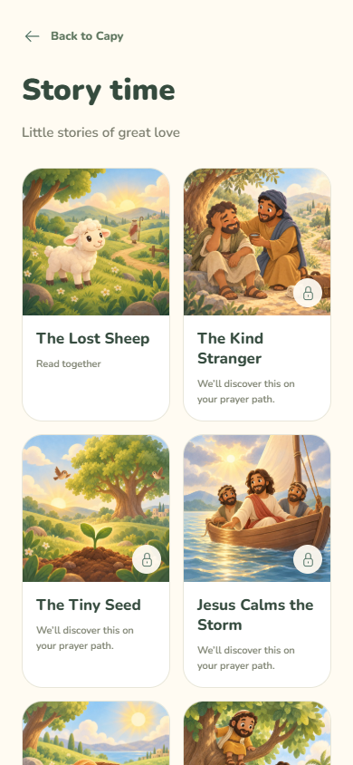
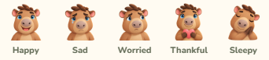

# Capy emotions and story illustrations

Five original Capy portraits and ten original Bible-story covers generated with the built-in ChatGPT Images tool, using the approved UI concept as the character/style reference. They are bundled offline and contain no text. Production exports total approximately 1.43 MB: five 256 × 256 transparent PNGs and ten 640 × 640 JPEGs (quality 88). Original PNGs are retained in the review outputs.

Home uses the five portraits with existing localized feeling labels and lesson links. The row keeps five targets at least 44px wide at 320px screen width. Little-prayer cards reuse these portraits; functional controls remain vectors. Story cards show their individual square cover, title, existing availability message, and a small lock badge when unavailable. Existing free stories and curriculum unlocks are unchanged. The story reader now accompanies every page with scenes and symbols; see [Story and prayer visuals](narrative-visuals.md).

`src/ui/illustrations.ts` maps stable content ids to bundled assets. `FeelingArt` falls back to the existing vector icon for an unmapped emotion, and stories without a mapped cover fall back to the book symbol. All labels remain in the content pack; no schema or narration changes were needed.

## Bundled files

- `apps/mobile/assets/illustrations/feelings/happy.png`
- `apps/mobile/assets/illustrations/feelings/sad.png`
- `apps/mobile/assets/illustrations/feelings/worried.png`
- `apps/mobile/assets/illustrations/feelings/thankful.png`
- `apps/mobile/assets/illustrations/feelings/sleepy.png`
- `apps/mobile/assets/illustrations/stories/lost-sheep.jpg`
- `apps/mobile/assets/illustrations/stories/good-samaritan.jpg`
- `apps/mobile/assets/illustrations/stories/mustard-seed.jpg`
- `apps/mobile/assets/illustrations/stories/calm-storm.jpg`
- `apps/mobile/assets/illustrations/stories/loaves-fish.jpg`
- `apps/mobile/assets/illustrations/stories/zacchaeus.jpg`
- `apps/mobile/assets/illustrations/stories/jesus-children.jpg`
- `apps/mobile/assets/illustrations/stories/prodigal-son.jpg`
- `apps/mobile/assets/illustrations/stories/two-houses.jpg`
- `apps/mobile/assets/illustrations/stories/sower.jpg`

## Exact generation prompts

Reference: the approved CapyPray UI concept sheet (five Capy expressions and three story covers). Each asset was generated independently.

### Shared emotion prompt

Use case: illustration-story. Production UI asset for CapyPray ages 4–8: exactly ONE square 1024x1024 illustrated Capy emotion portrait, on a genuinely transparent alpha background. Reference image is a STYLE and CHARACTER IDENTITY guide only; do not reproduce the sheet or its other items. Match the tan/brown capybara with round prominent muzzle, small round ears, brown hair tuft, blue warm eyes, little brows. Soft matte painted cartoon, rounded shapes, subtle texture. Front-facing head and upper shoulders fill 88–92% of square, both ears and entire hair tuft inside frame, large face readable at 48 pixels. Isolated character; no circular backdrop, no white outline, no drop shadow, no scenery, no lettering, no words, no Z marks, no decorative symbols. 

#### happy

Emotion HAPPY. Big warm smile, bright relaxed eyes, friendly slightly lifted eyebrows; content and welcoming, not manic. Only head and shoulders.

#### sad

Emotion SAD. A small downturned mouth, drooping outer eyebrows, gaze softly downward, one clear small tear on cheek. Gentle sadness, not distressed sobbing. Only head and shoulders.

#### worried

Emotion WORRIED. Raised inner eyebrows drawn together, eyes open looking slightly to the side, small uncertain closed mouth, shoulders gently raised. No tears, no smile, no terror. Clearly distinct from sad.

#### thankful

Emotion THANKFUL. Soft smile, affectionate warm eyes and relaxed brows, both small paws gently holding ONE coral-pink heart at the bottom below the muzzle. Keep head large and paws/heart simple.

#### sleepy

Emotion SLEEPY. Eyes softly closed, slight peaceful smile, head leaning toward two small paws tucked under one cheek. Do not include Z letters, stars, moon or floating symbols.

### Shared story-cover prompt

Use case: illustration-story. Create exactly ONE square 1024x1024 full-bleed story-cover illustration for CapyPray, a Christian prayer app for children ages 4–8. Reference sheet is a STYLE guide for its lower story covers only. Soft painted 2D cartoon children's book art, round gentle forms, subtle paper texture, cozy sage/cream/honey/peach palette, warm light. One simple scene with a strong central subject legible at 150px, keep essential subjects inside the central 75% for cover crops. No text, letters, numbers, signs, title, frame, border, UI, watermark, logos. No capybara in these Bible stories. People, when called for, are ancient Middle Eastern with warm medium-brown skin and simple period linen clothing. Jesus, when called for, has warm medium-brown skin, shoulder-length dark brown hair, short dark beard, cream robe and muted terracotta shawl; gentle friendly face. No fear, injury details, violence or photorealism. 

#### lost-sheep

A fluffy little cream lamb in the central foreground on a lush green hillside. A winding path leads toward distant rounded hills with a tiny shepherd walking to find it, carrying a wooden crook. The lamb appears safe and hopeful, not crying. Match the reference lamb's friendly design.

#### good-samaritan

A kind adult traveler kneeling beside a tired adult seated safely on a roadside stone, offering him a small cup of water. A rolled clean cloth and travel satchel nearby, olive tree, warm hills. Focus on the caring gesture and relief. No wounds, blood, bandages covering faces, robbers or weapons.

#### mustard-seed

A tiny seed with two bright green leaves sprouting from a small mound of rich soil in the central foreground. A large soft leafy mustard tree and two tiny birds are visible in the background, suggesting how the tiny seed can grow. Warm sunlight, simple garden and rounded hills.

#### calm-storm

Jesus sitting calmly in a small wooden sailboat with two relieved adult friends on a lake, one hand gently extended toward the now-peaceful water. Soft gray clouds part to warm light, small smooth ripples, distant rounded blue hills. Recognizable boat central, no huge waves, lightning or fear.

#### loaves-fish

A woven basket in the central foreground holding EXACTLY FIVE distinct small golden bread loaves, with EXACTLY TWO small cooked fish placed side by side on a folded cream cloth beside it. Green hillside, warm sunshine; two child hands gently offering the basket from lower corners. No extra food or fish, no words or numbers.

#### zacchaeus

Zacchaeus, a short adult man with a dark beard and ochre tunic, sitting safely on a thick low branch of a leafy sycamore tree at upper center, smiling down. Jesus stands next to the trunk looking up with a welcoming gesture. Rounded ancient village houses in the far background, warm garden palette.

#### jesus-children

Jesus seated at child height on a low garden stone, warmly welcoming THREE smiling young children gathered around him, one child holding his hand. Children with varied warm brown skin tones, curly and straight dark hair, simple pastel tunics. Peaceful shady olive garden. Gentle affection, welcoming eye contact.

#### prodigal-son

An elderly father with medium-brown skin and short gray beard warmly embracing his adult son in a simple dusty ochre tunic. The son has short dark hair, the father a muted sage robe. They stand near the rounded doorway of a small ancient home, warm afternoon light and a little olive tree. Focus on the hug and sense of being welcomed home.

#### two-houses

Two small friendly ancient stone houses with terracotta roofs in one landscape: the main house clearly sits on a broad solid gray rock at center-left; the smaller house at right sits on soft golden sand near calm water. Both houses intact, distinct visible foundations, soft blue hills, peaceful sun after rain. No disaster or collapse.

#### sower

A smiling ancient Middle Eastern farmer in a muted sage tunic and simple straw hat, scattering a few clearly visible seeds from one hand into rich brown furrows; a small seed bag in the other hand. Bright healthy green shoots and golden grain in the background. Rounded green hills, sunny, central sowing gesture clearly visible.

### Kind Stranger refinement

The helper initially resembled the Jesus character. The final asset uses a blue head wrap, ochre tunic, and a shorter beard to distinguish the traveler. Exact edit prompt:

Use case: precise-object-edit. Edit this story cover for The Kind Stranger. Change ONLY the appearance and clothing of the kneeling helper on the RIGHT so he is a distinct traveler, not the Jesus character used in other covers: short curly dark hair largely covered by a simple indigo-blue head wrap, a short close-cropped beard, warm ochre tunic and muted blue shoulder cloth. Preserve his warm medium-brown skin, smile, pose, hands, water cup, and helpful interaction. Keep the seated tired traveler on the LEFT, roadside, satchel, cloth roll, light, composition and children's painted cartoon style unchanged. No text, lettering, logos, halo, watermark or border. Square full-bleed cover.

## Validation

Mobile typecheck, 31 mobile tests, 17 content tests, avatar-web build, and Expo web export pass. `node tools/illustrations-smoke.cjs` checks all five feeling destinations, a single 320px row with 44px targets, moment cards, ten distinct decoded square covers, existing story locks, first-page artwork, and story advancement. It also captures the required avatar preview at port 5173. Review on physical iOS/Android devices remains a release check.

