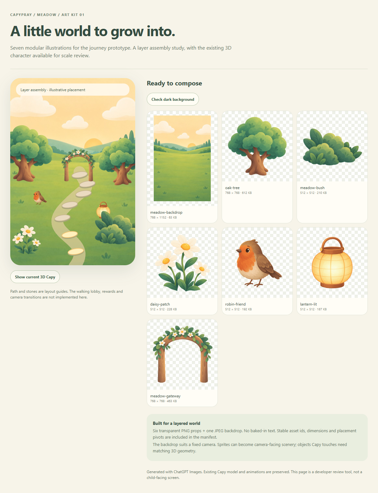
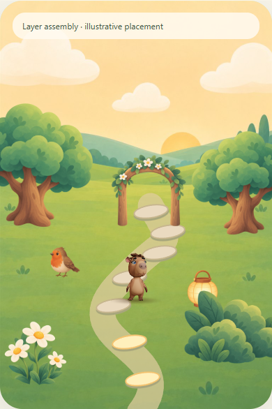
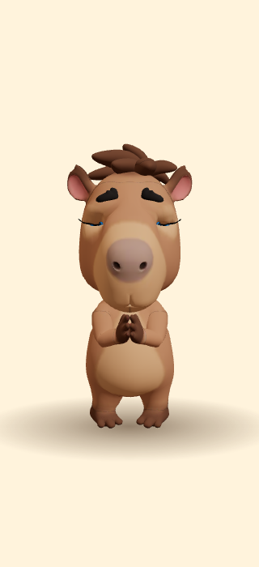

# Journey art kit and 3D/animation brief
Prepared 2026-09-19 from 76c23f9, including the new Capi_02.fbx takes. This is an asset handoff and review tool; the application lobby is not replaced.

## Delivered 2D kit
Seven original ChatGPT Images illustrations, visually matched to meadow-storybook.png:
| Id | Export | Intended role |
|---|---|---|
| meadow-backdrop | 768 × 1152 JPEG | Fixed-camera meadow clearing behind the scene |
| oak-tree | 768 × 768 RGBA PNG | Side scenery, reusable with careful mirroring |
| meadow-bush | 512 × 512 RGBA PNG | Foreground depth and soft path edges |
| daisy-patch | 512 × 512 RGBA PNG | Gratitude encounter or decorative milestone |
| robin-friend | 512 × 512 RGBA PNG | Authored encounter, faces left; not a wing animation sheet |
| lantern-lit | 512 × 512 RGBA PNG | Distant placed reward, or interface illustration |
| meadow-gateway | 768 × 768 RGBA PNG | Milestone landmark; open center is transparent |

Production files total 2,001,472 bytes (about 2 MB). All imagery is text-free. No generated words are embedded in the scenery. Original PNGs remain in the review outputs; full prompts and the reference role are recorded in [journey-prompts.json](art/journey-prompts.json).

Assets: apps/mobile/assets/illustrations/journey/.
Static React Native image map: apps/mobile/src/ui/journeyArt.ts.
Placement metadata: manifest.json in the asset directory. Pivots use normalized top-left coordinates; alphaBounds use image pixels and an alpha > 16 threshold. Bounds describe the visible silhouette, not physical collision geometry. The pivot is an initial placement aid; final feet/prop contact needs adjustment against the scene.

Importing JOURNEY_ART opts into bundling these images. No existing app screen imports it yet, so this handoff does not change the current home, voice, animations, progression, or production deployment.

## What should be 3D
| Element | First prototype | When a dedicated model is needed |
|---|---|---|
| Capy | Reuse the current rig and shipped GLB | No new character mesh or re-rig |
| Walkable ground | Simple plane/strip with muted material | Needed for consistent feet and contact shadows |
| Path stones | Reusable shallow rounded meshes, instanced | Needed if Capy stands on or crosses them with a moving camera |
| Lantern | Sprite for distant decoration | Small matching mesh if held, placed or viewed from behind |
| Trees, shrubs, flowers | Textured planes facing a constrained camera | Model only if the camera must orbit behind them |
| Gateway | Sprite landmark in the fixed-camera prototype | Model if Capy actually walks through it or the camera passes it |
| Encounter bird | Static sprite plus tiny positional reaction | Rig/sprite sequence if wing flaps or sustained flight matter |

The JPEG is not a seamless texture or skybox. These sprites provide one authored view. Use them for a constrained 2.5D camera, and avoid presenting their backs or letting them intersect the walking surface. Decide camera and scene scale before commissioning detailed environment models.

For a modelled prop, use the current normalized Capy height (1.6 scene units) as scale reference. Start with broad readable shapes, painted base color and matte materials, matching this kit. Ground-contact objects need pivots at the base; a held lantern needs a documented grip point. Keep props separate from the character rig.

Suggested prototype budgets, to verify on devices: 30 fps minimum on the agreed low-end Android test device; a small set of repeated meshes and materials; no extra realtime lights for every lantern. File size is not GPU memory: decoding all seven textures needs about 12.5 MB before mipmaps/overhead. Load only the current biome and constrain transparent overdraw.

## Animation inventory verified in the shipping GLB
The binary has 19 clips. The seven authored additions are:
| Source take | Baked clip | Approximate duration |
|---|---|---|
| Clapping | clap_full | 3.33 s |
| heart_signal | heart_full | 2.67 s |
| Idle_01_nod | listen_nod_full | 0.83 s |
| Pray_stand_loop | pray_hands_full | 6.63 s |
| Pray_stand_nod | pray_hands_nod | 2.00 s |
| Pray_knee_loop | kneel_pray | 7.30 s |
| Pray_knee_nod | kneel_pray_nod | 0.83 s |

The existing walk loop is about 0.83 s. Idle, talk, sleep and wake clips remain available. The state machine already selects full-body variants when not speaking and keeps procedural gestures available over speech.

Presence in the GLB does not imply that every clip has a public content/bridge name or is used by a lesson. The two authored prayer nods are not listed in the current public AVATAR_CLIPS catalog; route/schema wiring should be audited before using them in content. The clip-map missing list includes older names and must not be used alone to commission duplicate animation work.

## New animation work, ordered by need
**Prototype: no new authored take is a blocker.** Reuse walk with a short crossfade to idle, then heart/clap or the existing prayer pose. Animate world position/heading through a dedicated lobby mode; do not add movement to the lesson camera.

**First polish priority**
- walk_start / walk_stop: optional 0.3–0.6 s transitions, coordinated with actual speed and foot plants.
- turn_left / turn_right: optional short turns in place for larger heading changes; small turns can initially rotate the character's parent group while walking.
- sit_down / seated_idle / stand_from_sit: a calm sitting set if sitting is part of the loop. Existing sleep, kneeling and rise take names do not establish a matching seated transition set.

**Second polish priority**
- place_lantern: one deliberate action with a stable grip, placement contact and release point; roughly 1.5–2 s is a proposed brief, not an existing clip.
- notice_friend: gentle head/upper-body attention toward a path-side encounter; current look/nod can cover the prototype.
- authored wave: optional improvement to the existing procedural greeting, not a prerequisite.

Keep the exact current skeleton, bind pose, object names and proportions. Deliver separate clearly named takes in FBX compatible with the existing pipeline. Prefer in-place locomotion with documented stride/distance; make root-motion behavior explicit. Specify loop flags, contact/release timing and pose transitions. Supply left/right/front previews. Validate against both a static camera and the short walking shot. Do not hand-edit the exported GLB.

## Minimal 2D motion later
Tree/bush sway can be a very small pivot rotation; the bird can make a single hop; the lantern can have a separate short glow. These are application transforms, not new Capy skeletal takes. No such animation is bundled into these still PNGs. Reduced motion must retain a fully readable static scene. Avoid continuous movement near prayer text.

## Review and validation
Run from the repository root:
~~~sh
pnpm install --frozen-lockfile
pnpm --filter @capy/avatar-web build
node tools/journey-art-preview.mjs
~~~
Open http://127.0.0.1:8084. The optional Show current 3D Capy button loads the built embedded viewer. The path and stones in this page are illustrative layout guides. This is not an implemented game loop.

Browser asset check:
~~~sh
# Set PLAYWRIGHT_CHROMIUM if Playwright has no installed browser.
node tools/journey-art-check.cjs
~~~

Verified: all seven image exports decode at their declared dimensions; six props have true alpha and transparent corners; the gateway center is transparent; light/dark compositing and a 320 px layout; current Capy composited over the kit; walk, standing prayer and kneeling prayer previews. Twenty content tests, mobile typecheck and the avatar build passed. This isolated art checkout does not prepare voice recordings or deploy the app. Physical-device walking, depth sorting and performance remain work for the lobby implementation.

