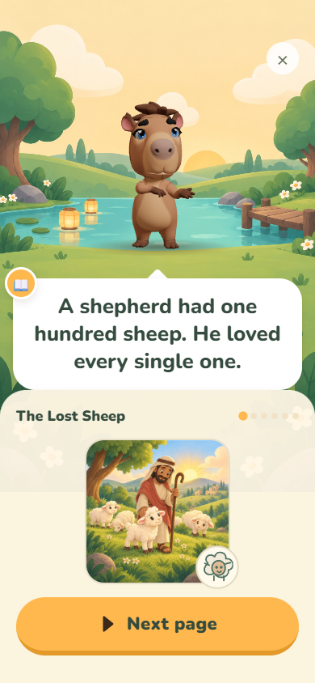
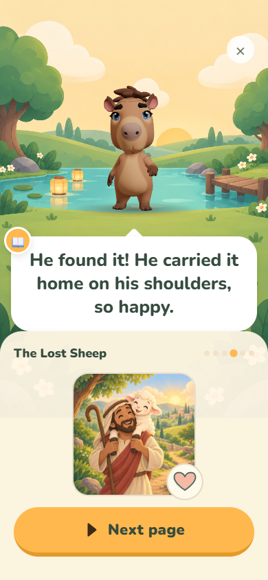
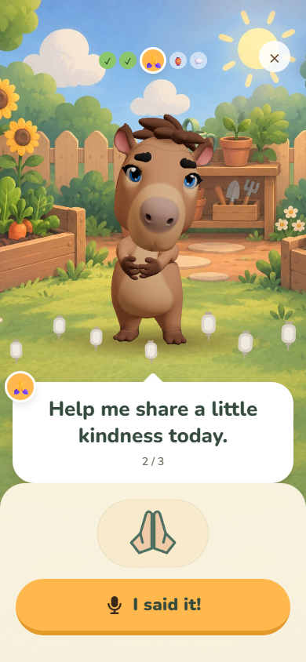
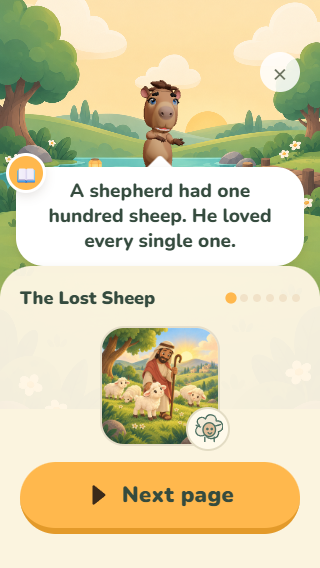
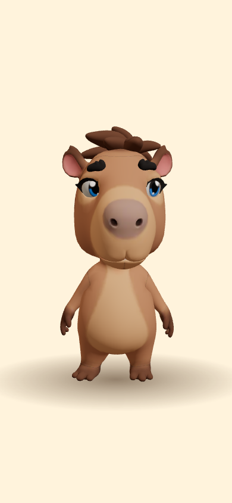

# Story and prayer visuals

CapyPray content pack 0.9.0 adds visual accompaniment to every story page and moral (60 steps) and every prayer line (119 lines across 37 prayers). English copy, audio references, lesson structure and availability rules are preserved.

Each of the ten stories now uses three illustrations: its existing cover and two new scenes. Scenes change at story beats; a small related symbol changes on the other pages. Prayer phrases have a compact illustrated symbol below the speech bubble. The art is decorative; narration, replay and the existing child-controlled prayer button still drive progress.

## Motion and layout

The panel enters with a 350 ms fade and 4 px lift. Its symbol makes one gentle 1.8 second movement: a 3 px float or a small scale change. No endless decorative animation, sound effects or automatic advancement are added. Reduced motion presents a still image. On windows shorter than 700 px, story art is 120 px instead of 180 px and prayer symbols are 52 px instead of 68 px; the speech bubble uses its compact layout.

## Content and localization

Optional `visual` fields on prayer lines/story pages and `moralVisual` on stories hold `art`, `symbol`, and `motion` ids. The validated catalog lives in `packages/content/src/visuals.ts`; image imports live in `apps/mobile/src/ui/narrativeArt.ts`. These identifiers do not depend on English words. Translators can retain or adjust cues independently of text. Existing packs without these fields still parse and render with the cover fallback.

To add an illustration, bundle the file, extend the art id catalog and static image map, then reference it from the content pack. To add a symbol, extend its catalog and `NarrativeSymbol`. All images have no embedded text; screen readers use the existing narrated text instead of repeated decorative labels.

## Assets and generation

Twenty original scenes were generated with the built-in ChatGPT Images tool. Each uses its story cover as a reference for character identity, clothing and palette. Shipping exports are 640 × 640 JPEGs at quality 88, totaling about 2.32 MB. Originals and exact prompts are retained in the review outputs; `narrative-art-prompts.json` records the full shared prompt, individual briefs and the anatomical correction applied to the prodigal-son scene. Thirty-two symbol ids reuse the existing vector palette and Capy portraits, with new SVG details authored locally.

## Validation

- Content validation: 52 lessons, 37 prayers, 25 minigames, 404 unchanged audio references.
- 20 content tests and 31 mobile tests pass, including visual asset coverage, invalid cue rejection and compatibility with older/translated packs.
- Mobile typecheck, avatar production build and Expo web export pass.
- `tools/narrative-smoke.cjs` checks all 60 story steps and 30 loaded images, prayer symbol progression, small screen layout and reduced motion, plus the actual avatar preview.
- Existing narration coverage remains 339 of 404 pack references; the validator's generic missing-file notice points at the pack audio directory while mobile uses its prepared audio bundle. No additional recordings are required by this change.
- Physical iOS/Android rendering has not been checked in this pass.

## Screenshots

