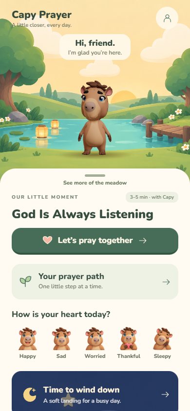
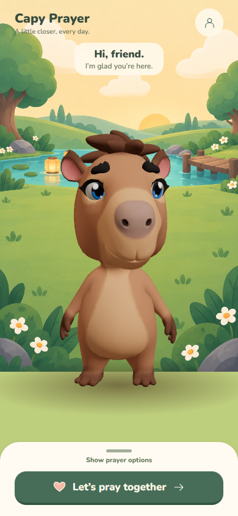

# Prayer variety and home panel — content pack 0.11.0

The home panel's decorative handle is now an accessible button and a vertical drag target, shared with the trail. Collapsing leaves the prayer action available and reframes Capy in the larger open space. The handle stays outside the ScrollView so scrolling content does not collapse it accidentally. A visible home card opens /trail; the old /journey history remains under My prayer memories.

The trail still previews the first seven stops. It is not the complete 42-lesson curriculum path. Curriculum ordering, entitlements and daily pacing are unchanged.

## Authored variation

Nineteen lesson entries now provide prayer alternatives: the introduction, fourteen curriculum lessons, and the sad, thankful, family and morning moments. Four new prayer arrangements reuse existing English recordings and visuals. Neighboring lessons that used the exact same prayer now start with different authored choices. Fourteen curriculum greetings also cycle on repeat visits.

Each valid lesson start increments a local per-lesson visit counter. The selected visit number is captured once for the session. The counter is persisted, so the next visit after a reload continues the rotation. It never marks completion, changes entitlements or awards lanterns. Completing a replay keeps the existing completion key and reward rules.

Optional beat fields: avatar_say.variations (text/audio pairs) and repeat_after_me.prayerVariants (prayer IDs). The content validator rejects missing, duplicate and different-skill alternatives. A child's explicit prayer intention takes precedence over automatic variation. Traditional prayers are unchanged. No runtime text generation is used.

Closing the introductory lesson now dismisses that introduction without forcing an immediate redirect back into it; dismissal does not complete the lesson or earn its lantern.

## Voice follow-up

The lantern reward now accepts its own pack audio reference and waits for speech completion before starting its automatic advance countdown. Nineteen previously unlinked lines have recording IDs but still need recordings. See voice-audit.md and voice-recording-queue.json. The new prayer variants reuse already catalogued Juan recordings.

## Verification

- Content validation: 52 lessons, 43 prayers, 25 minigames, 434 audio references.
- Mobile and content tests, narration inventory tests, mobile typecheck and avatar build.
- Isolated Chromium touch events: tap and swipe up/down on the home handle, home-to-trail entry and trail swipe; panel height changed from about 498 to 121 px at 390 × 844.
- Re-entered W1D1 three times, including a reload: different greetings, visit counter persisted, no completion or lanterns granted by starting or dismissing.
- Dismissing an unfinished introduction reaches home instead of looping.
- Visual checks at 390 × 844 and 320 × 568, using the actual avatar.

These browser touch checks do not substitute for a physical iPhone check in Expo Go.

