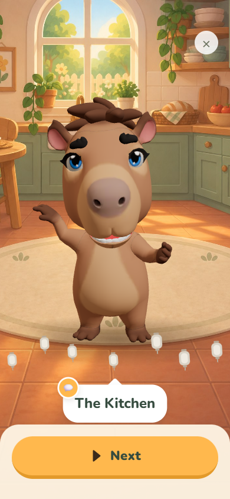
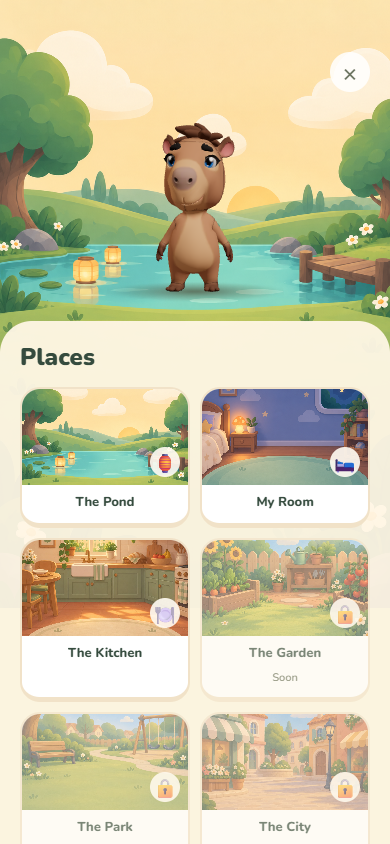

# Storybook scenes

Eight original illustrations generated with the built-in ChatGPT Images tool replace the remaining geometric placeholders. The app bundles JPEG copies (1024 × 1536, quality 88; 1.67 MB total). The original PNGs are retained in the review outputs. No runtime image service is used.

Places now shows scene previews with the existing English titles and progress locks. Scene ids and art are language-neutral; no words are embedded in the illustrations. Existing prayers, unlock requirements, and day/night tint behavior are preserved.

## Assets

| Scene id | Bundled file |
| --- | --- |
| kitchen | `apps/mobile/assets/backgrounds/kitchen-storybook.jpg` |
| garden | `apps/mobile/assets/backgrounds/garden-storybook.jpg` |
| park | `apps/mobile/assets/backgrounds/park-storybook.jpg` |
| city | `apps/mobile/assets/backgrounds/city-storybook.jpg` |
| school | `apps/mobile/assets/backgrounds/school-storybook.jpg` |
| car | `apps/mobile/assets/backgrounds/car-storybook.jpg` |
| river | `apps/mobile/assets/backgrounds/river-storybook.jpg` |
| mountain | `apps/mobile/assets/backgrounds/mountain-storybook.jpg` |

## Generation prompts

Reference: `apps/mobile/assets/backgrounds/bedroom-storybook.png`, used only to match the existing art style.

Shared prompt:

> Use case: illustration-story. Asset type: portrait 2:3 background for CapyPray, a calm prayer companion app for children ages 4–8. Create one complete scene, not a collage or interface. Match the attached bedroom reference ONLY for the illustrated storybook style: rounded cartoon shapes, matte softly painted surfaces, subtle paper texture, soft dimensional shading, warm welcoming light and muted sage, cream, peach colors. No realism. No characters, people, animals, text, letters, labels, logos, watermark, UI or border. Composition: camera at a small child's eye level, all scene-defining props mainly in the upper half and around edges, open uncluttered ground/floor in the central foreground where a 3D character will be composited; bottom third quiet for a UI overlay. Objects must remain recognizable when cropped to a narrow phone. 

Each scene adds the following specification:

### kitchen

A cozy sunny family kitchen. Rounded sage-green cabinets at the back, cream tile backsplash, arched window showing a leafy garden, wooden counter with bread basket and fruit bowl. Small dining table set with two plates at far left, never blocking the center. Golden morning light; warm terracotta floor and a simple oval cream rug in the empty center. Clearly a kitchen for a thankful mealtime prayer.

### garden

A sunny little vegetable and flower garden. Raised wooden beds of leafy carrots and tomatoes and friendly sunflowers at the sides, tiny potting bench with watering can in the back, low wooden fence and round leafy trees. Wide clear grassy center with a soft earthen path, peaceful fresh morning light.

### park

A neighborhood park on a gentle sunny day. Rounded trees, a little curved path, wooden park bench left, a small empty swing set on the upper right and low colorful flowers. Wide empty grassy foreground. Distinct from a vegetable garden: this is a place to play and be kind to friends.

### city

A welcoming walkable small town square on a sunny afternoon. Rounded pastel townhouses and shopfronts, blank awnings with no signage, terracotta roofs, flower pots, a little streetlamp and a bench. No traffic; wide quiet pedestrian paving in the center and foreground for a character to stand. A gentle familiar neighborhood, not skyscrapers.

### school

A cozy kindergarten classroom. Mint and cream walls, a large bright window, low wooden book cubbies with blank colorful book spines, a few chunky crayons in a cup, child-sized desks at the far left and right. Small blank green chalkboard on rear wall with only simple sun and flower drawings, absolutely no letters or numbers. Large open oval sage reading rug and empty floor in center foreground, sunny inviting learning space.

### car

A cheerful family car parked safely at a scenic picnic turnout, viewed from outside. Rounded small pastel sage car seen in three-quarter side view in the upper left, visible windows and two visible wheels, a curving quiet road in the distant hills, trees and soft blue sky. The car is parked on a paved lay-by behind a very wide flat grassy verge. Large empty grassy foreground in front of the parked car for a character, no character standing on the roadway. This scene accompanies a before-travel prayer.

### river

A peaceful winding turquoise river through rounded green hills, a tiny arched wooden footbridge in the upper middle distance, reeds and a few smooth rocks at the edges, dappled sun under leafy trees. Broad empty grassy riverbank in the center foreground, the water behind the character staging area. A few warm paper lanterns floating far back. Bright gentle daylight.

### mountain

A peaceful alpine lake beneath soft rounded blue and lavender mountain peaks, a few distant snowy caps and rounded evergreen trees at the sides. Still turquoise water reflecting the peaks, smooth boulders and tiny wildflowers around the edges. Broad empty pale grassy lakeshore in the center foreground for the character, all water behind. Warm morning light, cozy and inviting rather than epic or imposing.

## Verification

`node tools/scenes-smoke.cjs` exercises all eight new backgrounds, the kitchen prayer and quiet-time sequence, reward biome selection, Places thumbnails, and navigation at 320px. Mobile typecheck, the content tests, avatar-web build, and Expo web export are required checks.

The river and mountain lake share the pond's shorter background framing so Capy stands on the bank during quiet time. Visual checks passed in the web preview; physical iOS/Android devices remain a release check.

