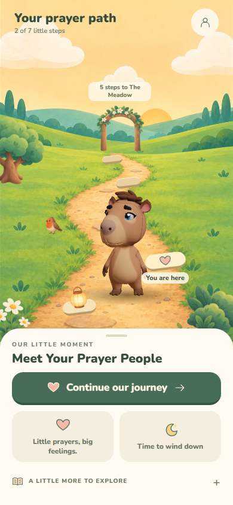
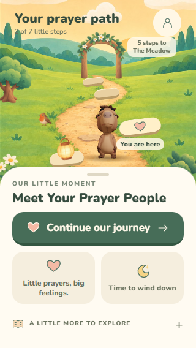
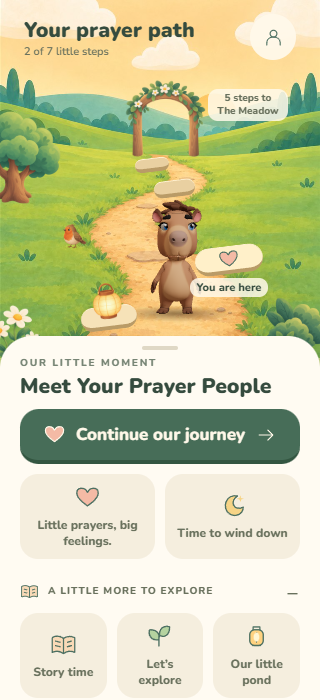
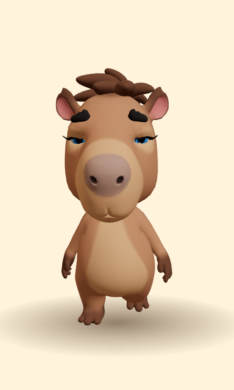

# Trail visual pass

The trail lobby now frames the painted background, landmarks and Capy in the space above its action sheet. Previously, the background continued behind the sheet while the landmarks used a different coordinate frame, leaving little visible ground and placing the arch in the sky.

- A trail-only scene height follows the measured sheet. The avatar receives viewport commands through the existing renderer interface. Leaving the trail clears this height and restores the usual framing.
- Capy occupies a smaller foreground band. Existing trees, flowers, shrub and bird sprites frame the trail.
- Flat, warm stone surfaces replace circular markers. The next stop retains a 68 × 56 touch target; the primary button remains an alternative.
- The arch ends at the distant path. Its caption moves beside it on short screens to avoid the header.
- Explore expands the secondary destinations. Quick prayer and bedtime remain directly accessible. Labels wrap, and the three-column row no longer imposes a 92 px minimum on each item.
- All child-facing copy still comes from the pack. No new imagery, recordings, currencies or progression rules were added.

## Verification

Tested in the real Expo web app with a fresh browser profile and synthetic progress:
- 390 × 844, 320 × 700, and 320 × 568 portraits, including expanded destinations.
- Expanded controls fit horizontally; the disclosure exposes its expanded state.
- Continue opens W1D3; returning restores the trail framing.
- Reduced motion and an aborted avatar request both leave the route usable.
- Opening a lesson and returning preserves completions and lanterns.

Also passed: 51 mobile tests, 24 content tests, mobile typecheck, content validation, and the avatar-web build. The content validator reports missing local audio files in this isolated checkout; voice playback was not tested. Physical-device performance and native screen-reader behavior still need device verification.

Run the app with `pnpm --filter @capy/mobile start --web --port 8086` after building avatar-web, then enter the prototype from Parent Corner.

