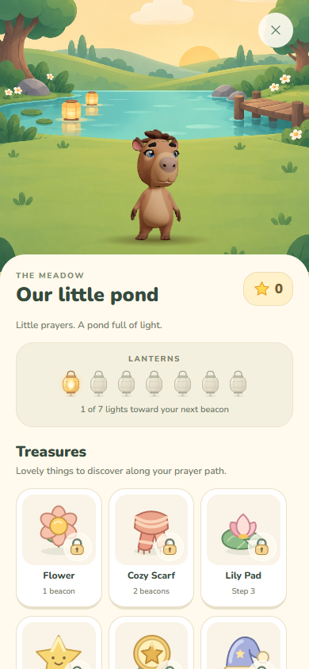
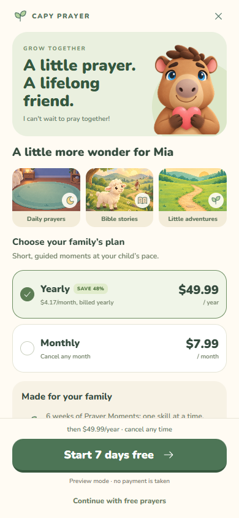
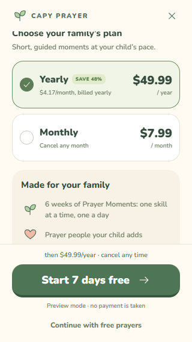
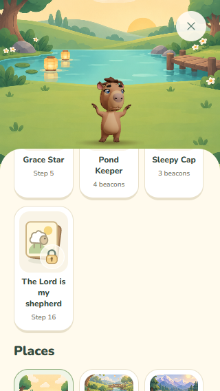

# Collectibles and parent offer — 0.12.1

Built on Fable's 9d25854, including first-prayer handoff, progressive home sections and grounded avatar framing.

## Visual changes

- One paper-lantern vector now serves the pond meter, in-scene lanterns, reward animation and companion icon. Warm ribs, a small flame and a soft glow distinguish lit lanterns from unlit ones. SVG gradients use instance IDs.
- Seven text-free collectible illustrations: flower, scarf, nightcap, lily pad, grace star, pond-keeper medal and a sheep verse card. The pack selects each visual via its asset field.
- A shared translucent lock badge sits over the picture rather than replacing or fading it. Reused in the pond, places, story shelf and curriculum cards.
- Pond cards state beacon or step requirements. Cosmetics and places still open through progress, not purchase. Eligible premium curriculum cards still lead through the existing parent gate; future lessons keep their pacing lock.
- The parent offer uses the existing cartoon Capy portrait and story/place artwork. The personalized heading, three previews and two plan cards show the offer before long-form detail.
- Selected-plan billing, the trial action and the free exit remain visible in a fixed footer. Trial details expand on request; restore remains in the scrollable content. A visible note identifies the existing Expo Go purchase simulation.
- Prices and trial length are unchanged. Existing Juan welcome audio is retained. Text remains in the English parent catalog or content pack, and artwork has no embedded text.

The layout removes unimplemented reminder, four-profile and weekly-report promises from the visible offer. It also replaces the previous absolute privacy claim and one-tap cancellation promise with the actual no-ad/no-voice-recording benefits. Real billing still requires the RevenueCat adapter; this visual pass does not implement purchases.

## Validation

90 existing checks pass: 62 mobile tests, 26 content tests and 2 narration inventory tests. Mobile typecheck, content validation and avatar build pass.

Isolated Chromium verification at 390 × 844 and 320 × 568 covered:
- Locked art remains visible and locked cosmetics cannot equip.
- An earned cosmetic equips and unequips.
- Premium curriculum entry goes to the parent gate.
- Annual/monthly selection updates both radio state and the visible billing statement.
- Continuing free does not grant premium.
- The existing sandbox trial grants its simulated entitlement.
- Trial details expand, no horizontal overflow, reduced-motion layout, and a visible primary/free action on a small screen.

Physical iPhone gestures and actual store transactions still need device testing. Screenshots use synthetic state.

